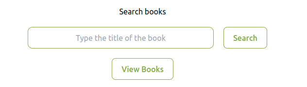
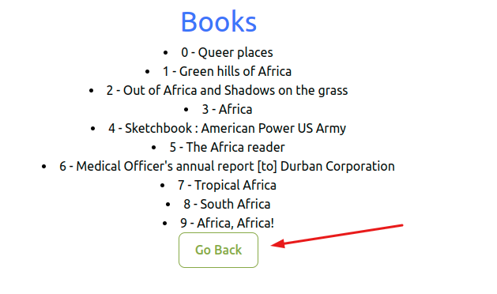

# Book Repository

This is a book repository where you can search books

## Instructions on how to set up locally
 ### Clone the project
  - Clone the project using the command `git clone git@github.com:felexkemboi/books.git`
  - In the root directory of the project(in command line), install the packages using `npm install`
  - After installing the necessary packages,fire up the local server using the command `npm run dev`
  - Copy the url given and open it with your favorite browser. Example `http://localhost:5173/`
  - Happy Coding!

## Instructions on how to use the app
 - This is the landing page where you can type the title of the book
  
 
 - Note the spinner when loading/fetching records from the API
  
 
 - This is the page showing the list of the books got(Note the `Go Back`) button which you can use to go back to the home page where you can search again
  

 - For the case where there are no books,this is how it looks(you need to go back and search again)
  